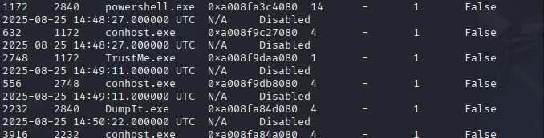
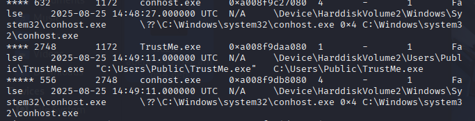
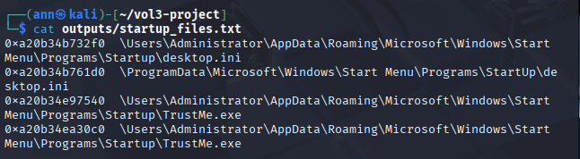
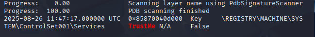
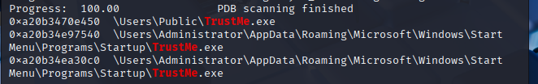

# Memory-Forensics-Analysis-of-a-compromised-windows-system

## Objective
The objective of this project was to investigate and analyze a memory dump acquired from a compromised Windows virtual machine in order to detect signs of malware infection, identify suspicious processes, and uncover potential persistence mechanisms. By leveraging the Volatility 3 framework, the analysis aimed to simulate a real-world incident response workflow and provide insight into attacker behavior.

## Skills Learned
- Performed memory forensics using Volatility 3 on a Windows RAM dump.
- Identified memory-resident malware and examined its process hierarchy.
- Investigated DLLs and registry artifacts to assess persistence techniques.
- Detected suspicious files in startup folders indicating persistence.
- Developed hands-on experience in post-incident analysis and forensic methodology.

## Tools Used
- Volatility 3 → Memory forensics framework for RAM analysis.
- Kali Linux VM → Analysis environment where Volatility 3 was installed and executed.
- DumpIt → Tool used to acquire a memory dump (memory.dmp) from the compromised Windows VM.

## Environment Setup
- Compromised System: Windows 10 VM (target system infected with TrustMe.exe).
- Acquisition Tool: DumpIt used to extract the memory dump from the Windows VM.
- Kali Linux: Kali Linux VM with Volatility 3 installed.
- Data Transfer: The memory dump was moved from the Windows VM to my Kali VM for analysis.

## Steps
1. Memory Acquisition:
The memory of the compromised Windows VM was captured using DumpIt, producing a memory.dmp file. This dump was then securely transferred to my Kali Linux VM for analysis.
2. Process Enumeration:
To list all running processes at the time of acquisition, the following command was executed:
vol -f image/mem.raw windows.pslist | tee outputs/02_pslist.txt

    

    An unusual process named TrustMe.exe was discovered, suggesting potential malicious activity.

3. Process Tree Analysis:
To visualize parent-child relationships of processes, the following command was run:
vol -f image/mem.raw windows.pstree | tee outputs/03_pstree.txt
The process tree revealed TrustMe.exe and its associated process chain, further confirming suspicious activity.

    

4. File Scan for Persistence:
To identify files linked to persistence mechanisms, a memory-wide file scan was performed using the command
vol -f image/memory.dmp windows.filescan | grep -i "startup" > outputs/startup_files.txt
The presence of TrustMe.exe within the Startup folder confirmed that the malware was configured to execute automatically on system reboot.

    

5. Registry Analysis (Services Key):
To investigate persistence via services, the Services registry hive was extracted and reviewed:
vol -f image/memory.dmp windows.registry.printkey --key "ControlSet001\Services" > outputs/services_registry.txt
grep -i TrustMe outputs/services_registry.txt
Registry entries referencing TrustMe.exe were identified under ControlSet001\Services, indicating another persistence mechanism.

     

6. Targeted File Scan:
To directly confirm the presence of the malware, a targeted scan was performed:
vol -f image/memory.dmp windows.filescan | grep -i TrustMe
Multiple references to TrustMe.exe were observed, corroborating its presence and persistence configuration.

    

## Findings
Suspicious Process: TrustMe.exe was running at the time of memory capture.

## Persistence Mechanisms Identified:
Presence of TrustMe.exe in the Startup folder.
Registry service entry under ControlSet001\Services referencing TrustMe.exe.

## Behavioral Indicators:
Process tree analysis showed suspicious parent-child relationships.

### Conclusion
This investigation successfully demonstrated the use of Volatility 3 in conducting memory forensics on a compromised Windows system. The analysis revealed the presence of a malicious process (TrustMe.exe) and confirmed its persistence mechanisms through both Startup folder artifacts and registry modifications.
